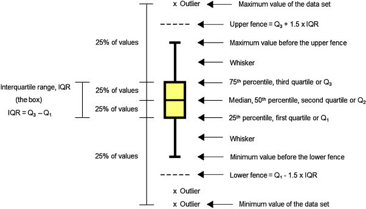
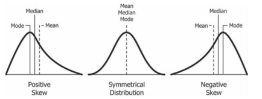

# How to look into Distribution of Variables
1. Histogram (helps to see the dispersion)
   1. approximates the normal distribution curve
   2. plot multiple histograms to see the difference
2. Box plots (median, quartile)

# Parts of data

 > **Box or whisker plots terms to be mindfull**

> **Dispersion of data **

# p-value and alpha

1. Null hypothesis
2. Alternative hypothesis  

**Alpha, the significance level, is the probability that you will make the mistake of rejecting the null hypothesis when in fact it is true.  The p-value measures the probability of getting a more extreme value than the one you got from the experiment.  If the p-value is greater than alpha, you accept the null hypothesis.  If it is less than alpha, you reject the null hypothesis.**
~~~
Normal distribution

student t-test

standardization of data

z-test vs t-test

levenes test

correlation test

ANOVA 

regression analysis
~~~